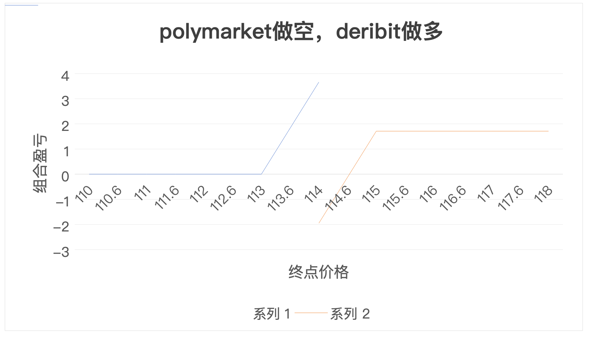

**Owner**：Helios

**状态**：Planned

**起止**：Start 2025-10-22 · Last Update 2025-10-25

---

## 🧩 假设

Polymarket 与 Deribit 存在期权套利机会，可以获得净正收益。

---

## 🛠️ 策略 / 测试方法

- **数据来源**：
    - Polymarket API（实时市场数据）
    - Deribit API（期权报价+现货指数）
    - 美债收益率数据（无风险利率）
- **实现方式**：
    - 脚本实时扫描套利机会
    - 5策略并行模拟（UTC 00:00/04:00/08:00/12:00/16:00平仓）
    - Black-Scholes概率计算 + 成本感知净EV评估
- **成败指标**：
    - 胜率 > 60%
    - 平均净收益（扣费后）> $100
    - Sharpe > 1.5
    - 最大回撤 < 30%

---
【新增】

**Polymarket 滑点计算公式**：Slippage = (Ave Price - Current Price)/Current Price * 100%

**Deribit 期权手续费计算通用式**: Fee = MIN( BaseFee , 12.5% * OptionPrice ) × Amount
- BaseFee：0.0003 BTC（BTC期权）或 0.0003 ETH（ETH期权）每份合约
- OptionPrice：每份期权的成交价格（以标的币种计价）
- Amount：成交合约数
- Fee = MIN(0.0003 * IndexPrice, 0.125 * OptionPrice) × Contracts（对于 USDC 结算的 BTC / ETH 期权）
- IndexPrice：BTC 指数价
- OptionPrice ：成交价格
- Amount ：成交合约数

分别计算每笔手续费后免除低的那笔手续费

---
**【新增】**

**保证金**：使用 API 提供的保证金计算接口 /private/get_account_summary , 传入头寸，选择的 S:PM 模型下接受需要的 初始保证金 (Initial Margin, IM)，

**C_fund 计算公式将变为**：

**重新计算“净EV”**:（与策略计算文档中的公式一致）

**策略盈亏分析图**

1. 定义价格范围:

* 设定一个围绕行权价的终点价格区间作为X轴。

* 例如: x_axis_prices = range(110000, 118000, step=100)

2. 计算盈亏数据:

* 遍历 x_axis_prices 中的每一个价格点。

* 调用 Calculate_Payoff() 函数计算出对应的组合盈亏（Y轴数据）。

* y_axis_pnl = [Calculate_Payoff(price) for price in x_axis_prices]

3. 绘制图表:

* 使用绘图库（如 Matplotlib, Plotly）将 x_axis_prices 和 y_axis_pnl 绘制成线图。

* 关键标注:

    -- 绘制一条 Y=0 的水平虚线作为盈亏平衡线。

    -- 在 K_low, K_high, K_polymarket 的位置绘制垂直虚线，并加以说明。

    -- 图表标题、X轴标签（终点价格）、Y轴标签（组合盈亏）必须清晰。

**EV 变化图**

**第一步：定义时间范围 (Define Time Range)**
设定一个动态的时间窗口作为图表的X轴，用于展示最近一段时间内的数据。

示例:

time_window = "过去60分钟"

sampling_frequency = "每30秒"

在查询数据时，X轴的数据点即为在这个时间窗口内，按采样频率记录下的所有时间戳。 x_axis_timestamps = query_timestamps(target_id, time_window)

**第二步：计算并记录 EV 数据 (Calculate & Log EV Data)**
此步骤与静态图表不同，它包含一个后台持续记录的过程和一个前端实时查询的过程。

2.1 后台持续记录 (Backend Logging Process):

需要一个独立的、持续运行的脚本，针对一个被“锁定”的交易机会（例如 "BTC > $114k"）。

该脚本按预设的sampling_frequency（例如每30秒）执行一次循环。

在每次循环中，调用您的核心EV计算模型 Calculate_Net_EV()，传入最新的实时市场数据（现货价、Polymarket买卖价、Deribit买卖价、隐含波动率等）。

将计算出的净EV (net_ev) 连同当前时间戳 (timestamp) 和其他关键市场快照数据，存入一个时序数据库或日志文件中。

2.2 前端实时查询 (Frontend Querying Process):

当需要绘制图表时，系统会向后台的数据库或日志文件发起查询。

查询条件为：在指定的time_window内，该交易机会的所有net_ev记录。

查询返回的结果即为图表的Y轴数据。 y_axis_net_ev = query_net_ev_data(target_id, time_window)

**第三步：绘制图表 (Plot the Chart)**
使用绘图库（如 Matplotlib, Plotly, 或前端的 D3.js, Chart.js），将查询到的 x_axis_timestamps 和 y_axis_net_ev 绘制成一条动态更新的线图。

关键标注 (Key Annotations):

绘制一条 Y=0 的水平虚线，作为EV的盈亏分界线。EV值在此线上方，代表理论上有利可图。

绘制一条水平的“入场阈值”线（例如 Y=50），作为您认为机会足够好、值得执行的决策参考线。

图表标题（例如 “BTC > $114k 机会价值演变”）、X轴标签（时间）、Y轴标签（净期望收益 / Net EV in USD）必须清晰。

好的，遵照您的要求，我们来为最后一个、也是最重要的图表——**“策略整体表现图 (Equity Curve)”**，设计一份同样结构清晰、标准化的开发文档。

这份文档将详细说明如何记录交易结果，并将其可视化为衡量策略长期盈利能力的最终凭证。

**策略整体表现图 (Equity Curve)**

**第一步：定义交易序列范围 (Define Trade Sequence)**

* 将策略自开始以来，所有**已平仓结算**的交易，按时间顺序排列，形成一个从1到N的序列作为图表的X轴（其中N是已完成的总交易笔数）。
* **示例**:
    * 假设策略已经完成了150笔交易。
    * X轴的数据即为一个代表交易次序的整数序列。
        `x_axis_trade_numbers = range(1, 151)`

**第二步：计算累计盈亏数据 (Calculate Cumulative P&L Data)**

* **2.1 数据记录 (Data Logging)**:
    * 您的交易系统中必须有一个**“交易日志”**数据库或文件。
    * **每一笔交易在平仓后**，都必须记录其最终的、已实现的**净盈亏 (Net P&L)**。这个净盈亏是扣除了所有手续费、滑点和资金成本后的最终数字。

* **2.2 数据查询与计算 (Data Query & Calculation)**:
    * 从“交易日志”中，按时间顺序查询出所有已平仓交易的`Net P&L`列表。
        `pnl_per_trade_list = query_all_closed_trades_pnl()`
        `# -> [+$55.30, -$25.50, +$80.10, ...]`
    * 计算这个盈亏列表的**累计和 (Cumulative Sum)**，以得到代表账户权益增长的Y轴数据。为了让曲线从原点开始，通常在列表最前面加上一个0。
        `y_axis_cumulative_pnl = np.cumsum([0] + pnl_per_trade_list)`

#### **第三步：绘制图表 (Plot the Chart)**

* 使用绘图库（如 Matplotlib, Plotly）将 `x_axis_trade_numbers` 和 `y_axis_cumulative_pnl` 绘制成一条线图。

* **关键标注 (Key Annotations)**:
    * 绘制一条 **`Y=0` 的水平虚线**，作为**策略整体的盈亏分界线**。一条健康的权益曲线应该稳定地运行在这条线的上方。
    * 标注出**历史最高点 (High-Water Mark)** 和**历史最大回撤 (Max Drawdown)** 的区间。最大回撤是衡量策略风险（可能面临的最大亏损）的最重要指标之一。
    * 图表标题（例如 “策略权益曲线 / Strategy Equity Curve”）、X轴标签（交易笔数 / Number of Trades）、Y轴标签（累计盈亏 / Cumulative P&L in USD）必须清晰。

**结果表展示的参数**：

market_title

timestamp

investment

spot

poly_yes_price vs. deribit_prob

expected_pnl_yes

total_costs

EV

IM

EV / IM

---
🔗 **相关链接**：

- 数据流程图:

- 

- [策略计算文档](https://wise-sneeze-a87.notion.site/2931b2bff84180b893ffdf86d6892089)
- [**技术需求文档**](https://wise-sneeze-a87.notion.site/2941b2bff84180d982b1e89347ab374b)

---

## 📊 结果

- **样本量**：计划收集3个交易日的实时数据
- **关键统计**：待测试完成后填写
- **观察到的问题**：

---

## 🎯 结论

**假设是否成立？ → [待验证]**

- **明确回答**：需要实际数据验证
- **下一步**：
    1. 实现数据采集和策略计算引擎
    2. 运行2周实时监控收集数据
    3. 基于实证结果决定是否继续投入

---

## 📋 补充说明

### 5个测试策略

| 策略 | 平仓时间(UTC) | 测试重点 |
| --- | --- | --- |
| A | 00:00 | 最差流动性下的成本边界 |
| B | 04:00 | 早期平仓的可行性 |
| C | 08:00 | **基准策略** - Deribit结算时 |
| D | 12:00 | 最优流动性平仓 |
| E | 16:00 | 完全持有到期的风险收益 |

### 关键风险监控

- **时间风险**：8小时窗口的价格波动
- **流动性风险**：不同时间段的滑点成本
- **执行风险**：平台可用性和API延迟

### 成功标准细化

- **技术成功**：系统稳定运行，数据准确
- **业务成功**：至少2个策略净EV > $100
- **产品成功**：用户能理解并执行推荐策略

[代码仓库](https://github.com/lazylemoncat/ProArb_MVP)

